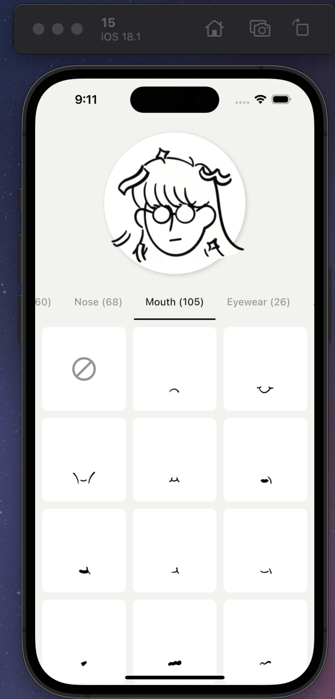

# Notion Avatar Builder

## Features

- Create customized avatars with Notion's avatar assets


## Installation

1. Ensure you have Flutter installed on your machine. If not, follow the [Flutter installation guide](https://flutter.dev/docs/get-started/install).

2. Clone this repository:
```bash
git clone https://github.com/yourusername/notion_avatars.git
cd notion_avatars
```

3. Install dependencies:
```bash
flutter pub get
```

4. Run the app:
```bash
flutter run
```



Credits: [Notion](https://x.com/NotionHQ/status/1876683661158023440)